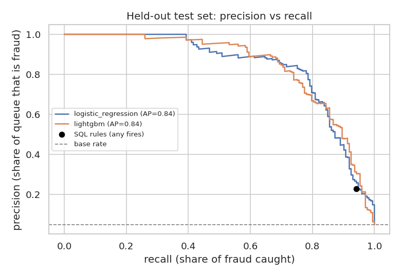

# Screening Fraudulent Job Postings: Rules vs. Machine Learning Under a Review Budget

A trust & safety team can only manually review a small share of new job postings. This project answers:
**which postings should reviewers look at first, and how much fraud does each approach catch for the same review effort?**

It compares a transparent **SQL rule set** (DuckDB) against **text + metadata models** (logistic regression, LightGBM),
evaluated on **companies the model has never seen**, and turns the result into an operating recommendation.



## Headline results (held-out test set: 3,576 postings from unseen posters, 173 fraudulent)

| Review budget | Postings reviewed | Share of queue that is fraud | Share of all fraud caught |
|---|---|---|---|
| Top 2% by risk score | 72 | 97% | 40% |
| **Top 5% by risk score** | **179** | **74%** | **77%** |
| Top 10% by risk score | 358 | 44% | 92% |
| SQL rules (any rule fires) | 720 | 23% | 94% |

The base rate is 4.8%, so a 5% review budget produces a queue that is roughly **15× richer in fraud** than random review.

| Model (unseen posters) | ROC-AUC | PR-AUC |
|---|---|---|
| Logistic regression (TF-IDF + metadata) | 0.979 | 0.837 |
| LightGBM (TF-IDF + metadata), selected by CV | 0.975 | 0.842 |

5-fold cross-validation on the training set (also grouped by poster) gave PR-AUC **0.66 ± 0.12**, so treat
0.66–0.84 as the realistic range: fraud is concentrated in a few large scam operations and results vary with which ones land in a fold.

## Key findings

1. **Missing information is the strongest signal.** In the training set, postings with no company profile are fraudulent
   17.6% of the time vs 2.0% when a profile exists; postings without a company logo, 15.3% vs 2.0%.
2. **A random train/test split overstates performance.** 400 of the 866 fraud cases share a description with another posting,
   and fraud comes from a small number of repeat posters. With the *same* logistic regression, a random split gives PR-AUC **0.957**;
   holding out unseen posters gives **0.837**. All headline numbers above use the grouped split.
3. **Rules catch most fraud but cost 4× the review effort.** The six SQL rules flag 20% of postings to catch 94% of fraud (23% precision).
   At that same volume the model is no better (96% recall), but when the budget is tight the model wins: 5% of postings catches 77% of fraud.
4. **The fraud the model misses looks legitimate.** Among fraud outside the top-5% queue, 63% have a company logo and 58% a company profile,
   vs 22% and 21% among fraud that was caught. Catching these needs signals the dataset doesn't have (poster account age, domain verification, payment details).

## Recommendation

- Route the **top ~5% of new postings by model score** to manual review; that catches roughly three-quarters of fraud at a queue precision near 75%.
- Keep the **SQL rules as an explainable second layer** (e.g. auto-hold postings with no logo *and* no company profile), since they're easy to audit and explain to stakeholders.
- Add **account-level signals** to close the gap on professional-looking scams, which is where most misses come from.

## Method

| Step | What | Where |
|---|---|---|
| 1 | Split by **poster** (company profile text, or description when the profile is missing) with `StratifiedGroupKFold`; 20% of posters held out | notebook §1 |
| 2 | Profile fraud rates by segment and missing fields (training set only) | §2 |
| 3 | Six transparent screening rules in SQL; precision, recall and alert volume per rule | `sql/rules.sql`, §3 |
| 4 | TF-IDF (word 1–2-grams) on title/profile/description/requirements/benefits + one-hot metadata + missing-field flags; logistic regression vs LightGBM, 5-fold grouped CV, selected on PR-AUC | §4 |
| 5 | Single evaluation on held-out posters; comparison with a random split to quantify leakage | §5 |
| 6 | Precision/recall at fixed review budgets; rules vs model at equal volume | §6 |
| 7–8 | Top model features; profile of missed fraud | §7–8 |

PR-AUC (average precision) is the primary metric because with 4.8% fraud, ROC-AUC mostly rewards ranking the large pool of legitimate postings.

## Project history

This started as a team course project (UMD DATA602). The original notebook is kept in
[`archive/team_course_notebook.ipynb`](archive/team_course_notebook.ipynb). It compared bag-of-words logistic regression (5-fold CV ROC-AUC 0.85, computed on hard 0/1 predictions rather than probabilities),
GloVe + a small neural network, and DistilBERT embeddings with logistic regression/XGBoost (XGBoost: ROC-AUC 0.97 on a random 80/20 split),
plus SMOTE resampling and a graph neural network over similar postings.

This version rebuilds the analysis to be reproducible and decision-oriented:
- the split is grouped by poster, because the random split used originally lets copies of the same scam appear in train and test;
- the graph neural network was dropped, because it was trained and scored on the same postings and the graph construction step wasn't in the notebook;
- a rule baseline and review-budget analysis were added, since that's how a screening team actually decides.

## Run it

```bash
python -m venv .venv && source .venv/bin/activate
pip install -r requirements.txt
# download data/fake_job_postings.csv (see data/README.md)
jupyter nbconvert --to notebook --execute fraud_screening.ipynb   # ~8 min on 2 CPU cores
```

`fraud_screening.py` is the same notebook in plain-text (jupytext percent) format, for readable diffs.

## Repository layout

```
fraud_screening.ipynb      analysis notebook (executed, with outputs)
fraud_screening.py         same notebook as a script (jupytext)
sql/rules.sql              screening rules, run in DuckDB
images/                    charts used in this README
data/README.md             where to get the dataset
archive/                   original team course notebook
```

Tools: Python, pandas, scikit-learn, LightGBM, DuckDB (SQL), matplotlib/seaborn, Jupyter.
